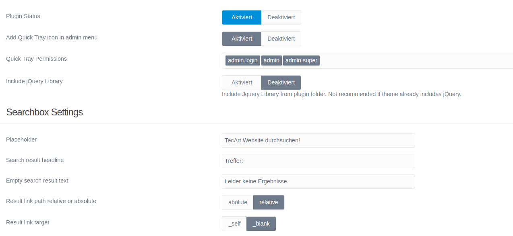
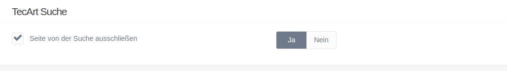

[](https://www.tecart.de)

# TecArt Search Plugin

**This README.md file should be modified to describe the features, installation, configuration, and general usage of the plugin.**

The **Tec Art Search** Plugin is an extension for [Grav CMS](http://github.com/getgrav/grav). Search Grav Pages in Frontend. Search based on jQuery. Useful for static websites when webserver does not support PHP.
When typing into searchbox autosuggestion the results are shown in a livesearch layer.
There is no extra result page for all pages with that content. you can directly click one of the pages in a search result layer.

Searchword / string is searched in title and content of pages.

## Screenshot


## Required

- jQuery

## Installation

Installing the TecArt Search plugin can be done in one of three ways: The GPM (Grav Package Manager) installation method lets you quickly install the plugin with a simple terminal command, the manual method lets you do so via a zip file, and the admin method lets you do so via the Admin Plugin.

### GPM Installation (Preferred)

To install the plugin via the [GPM](http://learn.getgrav.org/advanced/grav-gpm), through your system's terminal (also called the command line), navigate to the root of your Grav-installation, and enter:

    bin/gpm install tecart-search

This will install the TecArt Search plugin into your `/user/plugins`-directory within Grav. Its files can be found under `/your/site/grav/user/plugins/tecart-search`.

### Manual Installation

To install the plugin manually, download the zip-version of this repository and unzip it under `/your/site/grav/user/plugins`. Then rename the folder to `tecart-search`. You can find these files on [GitHub](https://github.com//grav-plugin-tecart-search) or via [GetGrav.org](http://getgrav.org/downloads/plugins#extras).

You should now have all the plugin files under

    /your/site/grav/user/plugins/tecart-search

> NOTE: This plugin is a modular component for Grav which may require other plugins to operate, please see its [blueprints.yaml-file on GitHub](https://github.com//grav-plugin-tecart-search/blob/master/blueprints.yaml).

### Admin Plugin

If you use the Admin Plugin, you can install the plugin directly by browsing the `Plugins`-menu and clicking on the `Add` button.

## Configuration

Before configuring this plugin, you should copy the `user/plugins/tecart-search/tecart-search.yaml` to `user/config/plugins/tecart-search.yaml` and only edit that copy.

Here is the default configuration and an explanation of available options:

```yaml
enabled: true
quick_tray: true
quick_tray_permissions:
    - admin.login
    - admin
    - admin.super
includes_jquery: false
searchbox_placeholder: 'TecArt Website durchsuchen!'
index_storage: pages
searchresult_target: _blank
searchresult_path: relative
searchresult_headline: 'Treffer:'
searchresult_empty: 'Leider keine Ergebnisse.'
```

Plugin settings in Grav backend



## Exclude pages from index

In options tab of page settings you can set option to ignore page from search.



## Indexing

By click on the **Create Search Index** button in plugin settings an index file with all searchable pages is created.
Only pages with **$page->routable()** and  **$page->published()** are included.

```json
[
    {
        "title": "Add-On-Framework f\u00fcr TecArt CRM Pro",
        "content": "Kreieren Sie Ihre eigenen integrierten Add-ons f\u00fcr die CRM-Software von TecArt \u2013 unser professionelles Entwickler-Framework macht es m\u00f6glich. Dank zukunftsweisendem Customizing bleiben Sie in Ihren **Anwendungen und Erweiterungen flexibel und erschaffen eigene, effiziente Zusatzl\u00f6sungen** f\u00fcr Ihr Unternehmen. Setzen Sie mit dem Add-on-Framework auf eine Individuall\u00f6sung mit tiefer Integration in die Softwarestruktur!",
        "route": "\/add-on-framework",
        "location": "http:\/\/172.17.0.2\/add-on-framework"
    },
    {
        "title": "AGBs & rechtliches der TecArt GmbH",
        "content": "- AGB - Allgemeine Gesch\u00e4ftsbedingungen\n- Vertrag zur Auftragsverarbeitung\n- Verf\u00fcgbarkeitsregelung",
        "route": "\/agb-avv-verfuegbarkeitsregelung",
        "location": "http:\/\/172.17.0.2\/agb-avv-verfuegbarkeitsregelung"
    },
    {
        "title": "TecArt Cloud Einstieg - mind. 435\u20ac sparen",
        "content": "Nutzen Sie die Chance und steigen mit dem neuen TecArt CRM Pro in die deusche Cloud ein. Um Ihnen den Beginn leicht zu machen, haben wir ein unschlagbares Angebot geschn\u00fcrt.",
        "route": "\/aktionen",
        "location": "http:\/\/172.17.0.2\/aktionen"
    }
]
```

## Usage

**Describe how to use the plugin.**

To put a searchbar in your theme eg. into header or sidebar, you have to include the searchbox partial.
You can copy the twig file into your theme folder.

Plugin Path:

    /your/site/grav/user/plugins/tecart-search/templates/partials/tecart-search-searchbox.html.twig

Theme Path Example:

    /your/site/grav/user/themes/tecart-website-front/templates/partials/tecart-search-searchbox.html.twig

Code:

```twig



```

## To Do

- [ ] Multilanguage support

## Known Issues

- N/A
