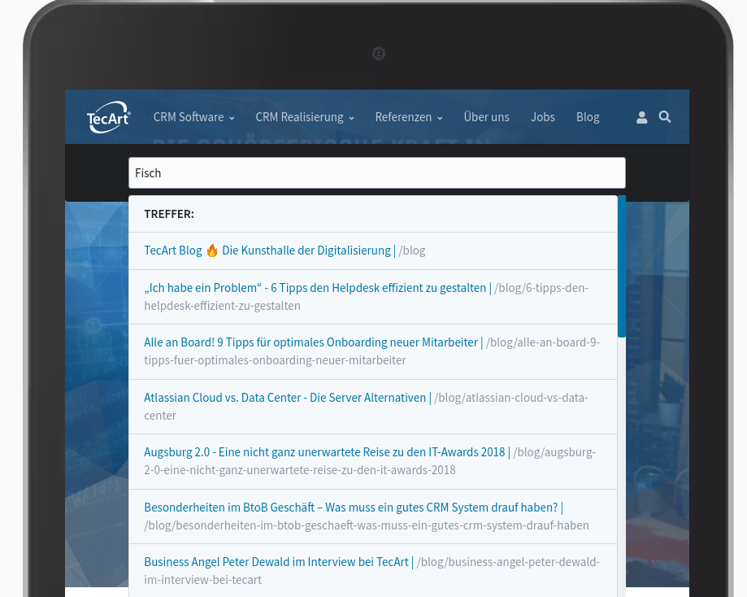

[](https://www.tecart.de)

# TecArt Search Plugin

**This README.md file should be modified to describe the features, installation, configuration, and general usage of the plugin.**

The **Tec Art Search** Plugin is an extension for [Grav CMS](http://github.com/getgrav/grav). Search Grav Pages in Frontend. Search based on jQuery. Useful for static websites when webserver does not support PHP.
When typing into searchbox autosuggestion the results are shown in a livesearch layer.
There is no extra result page for all pages with that content. you can directly click one of the pages in a search result layer.

Searchword / string is searched in title and content of pages.

## Screenshot



## Required

- jQuery

## Installation

Installing the TecArt Search plugin can be done in one of three ways: The GPM (Grav Package Manager) installation method lets you quickly install the plugin with a simple terminal command, the manual method lets you do so via a zip file, and the admin method lets you do so via the Admin Plugin.

### GPM Installation (Preferred)

To install the plugin via the [GPM](http://learn.getgrav.org/advanced/grav-gpm), through your system's terminal (also called the command line), navigate to the root of your Grav-installation, and enter:

    bin/gpm install tecart-search

This will install the TecArt Search plugin into your `/user/plugins`-directory within Grav. Its files can be found under `/your/site/grav/user/plugins/tecart-search`.

### Manual Installation

To install the plugin manually, download the zip-version of this repository and unzip it under `/your/site/grav/user/plugins`. Then rename the folder to `tecart-search`. You can find these files on [GitHub](https://github.com//grav-plugin-tecart-search) or via [GetGrav.org](http://getgrav.org/downloads/plugins#extras).

You should now have all the plugin files under

    /your/site/grav/user/plugins/tecart-search

> NOTE: This plugin is a modular component for Grav which may require other plugins to operate, please see its [blueprints.yaml-file on GitHub](https://github.com//grav-plugin-tecart-search/blob/master/blueprints.yaml).

### Admin Plugin

If you use the Admin Plugin, you can install the plugin directly by browsing the `Plugins`-menu and clicking on the `Add` button.

## Configuration

Before configuring this plugin, you should copy the `user/plugins/tecart-search/tecart-search.yaml` to `user/config/plugins/tecart-search.yaml` and only edit that copy.

Here is the default configuration and an explanation of available options:

```yaml
enabled: true
quick_tray: true
quick_tray_permissions:
    - admin.login
    - admin
    - admin.super
includes_jquery: false
searchbox_placeholder: 'TecArt Website durchsuchen!'
index_storage: pages
searchresult_target: _blank
searchresult_path: relative
searchresult_headline: 'Treffer:'
searchresult_empty: 'Leider keine Ergebnisse.'
```

Plugin settings in Grav backend


## Page option settings


### Exclude pages from index

In options tab of page settings you can set option to ignore page from search.

### Set higher priority in search result

In options tab of page settings you can set if page has a higher priority in search result list.
List items are sorted by this field (true/false) descending.

## Indexing

By click on the **Create Search Index** button in plugin settings an index file with all searchable pages is created.
Only pages with **$page->routable()** and  **$page->published()** are included.

```json
[
    {
        "title": "CRM Preise - Cloud Server Vergleich \u2696 TecArt CRM Pro",
        "content": "Die Kosten f\u00fcr den Betrieb der TecArt CRM-Software sind ebenso individuell wie Ihre Anforderungen. Je nach Bedarf und Lastenheft kann unsere [kostenfreie CRM-Freeware](https:\/\/www.tecart.de\/crm-free \"Kostenlose CRM Software - Cloud CRM Free\") bereits alle Bed\u00fcrfnisse erf\u00fcllen. Wollen Sie hoch hinaus mit Ihrem Business, lohnt sich die Investition in unsere [Cloud-Server-Software \u2013 ab 38 Euro im Monat](https:\/\/www.tecart.de\/crm-professional#konfigurieren \"TecArt Preise CRM Pro\") f\u00fcr jeden Nutzer.",
        "route": "\/cloud-server-software",
        "location": "http:\/\/172.17.0.2\/cloud-server-software",
        "has_higher_priority": true
    },
    {
        "title": "24\/7 Kundenservice - Das m\u00fcssen Support Ticket Systeme leisten",
        "content": "##Was lernen Sie aus diesem Artikel?\n> Lassen Sie den Kunden weiterhin K\u00f6nig sein, aber ziehen Sie daraus Ihren eigenen Nutzen! Ticketsysteme sind wahre Servicewunder, die f\u00fcr Sie arbeiten. Die wichtigsten Funktionen, die Sie hierbei wirklich brauchen und wissen sollten, beschreibe ich Ihnen zusammengefasst im Artikel. Und weil eine Software nur so gut ist, wie ihr monet\u00e4rer Mehrwert, teile ich mit Ihnen einige Kniffe zur schnellen Einsch\u00e4tzung Ihrer Einsparpotenziale. \n\n \n\n##So verk\u00fcrzen Ticketsysteme die Bearbeitungszeiten von Kundenanfragen\nEin [Support Ticket System ](https:\/\/www.tecart.de\/ticketsystem) kanalisiert und strukturiert eingehende Anfragen. Es erm\u00f6glicht eine koordinierte Abarbeitung und integriert definierte Service-Prozesse. Eingehende Anfragen k\u00f6nnen in Kategorien unterteilt und an verantwortliche Teams oder einzelne Mitarbeiter zur Abarbeitung delegiert werden. Anfragen werden aus verschiedenen Quellen zusammengef\u00fchrt: Support E-Mails werden genauso bearbeitet, wie zum Beispiel Kundenanfragen \u00fcber Ihre Webseite via Web-Formular oder Kundenportal. Auch telefonisch angenommene Anfragen werden im System aufgenommen, beosnders einfach geht das alles, wenn die Kommunikationskan\u00e4le (E-Mail, Telefonanlage, Website\/Chat) direkt an das Ticketsystem angebunden sind. Im Idealfall ergibt sich eine Kundenhistorie - dank dieser Zentralisierung (360 Grad Blick) behalten Sie so den \u00dcberblick. Gute Ticketing-Systeme sind auch immer gute Collaboration-Tools, denn es geht im Kern um externe und interne Kommunikation. Nicht umsonst findet man diese Funktion oft in CRM-Systemen wieder.  Benachrichtigungen und Wiedervorlagen\/Erinnerungen stellen sicher, dass Anfragen nicht verloren gehen oder vergessen werden. Genau das, was Ihre Kunden zus\u00e4tzlich auf die Palme bringen w\u00fcrde.\n\n##Welche Funktionen muss ein Support Ticket System bieten?\nUm das von Ihnen gew\u00fcnschte, hohe Ma\u00df an Servicequalit\u00e4t zu erreichen, m\u00fcssen Ihre Prozesse stimmen! Die Abarbeitung einer Anfrage bzw. die Behebung eines Problems darf nicht stagnieren und der Bearbeitungsstand muss sich laufend \u00e4ndern. \u00dcber jede \u00c4nderung sollte der Anfragesteller informiert werden (z.B. Status-E-Mail).  Nur so f\u00fchlt sich ein Kunde nicht hingehalten, vergessen oder vernachl\u00e4ssigt. Der Lohn ist eine positive Einstellung zu Ihrem Unternehmen und Ihrem Service, auch wenn mal etwas nicht so funktioniert, wie erwartet. Das zahlt sich in der Regel durch Kundentreue und hohe Cross- und Upselling-Chancen aus. Besonders bei der Abbildung Ihrer Workflows und m\u00f6glicher Automatismen brauchen Sie ein Trouble Ticket System, dass sich hervorragend auf die eigenen Abl\u00e4ufe anpassen l\u00e4sst. Zum Beispiel [IT-Abteilungen, IT-Dienstleister und Softwarehersteller brauchen ein anpassbares Ticketsystem mit CRM- und ERP Funktionen ](https:\/\/www.tecart.de\/software-fur-it-branche).  \n\n \n**Abbildung:** [Screenshots vom TecArt CRM- & ERP f\u00fcr IT-Unternehmen ](https:\/\/www.tecart.de\/software-fur-it-branche#Features-IT-Unternehmen)\n\n\n\n###Mehr als nur Textfelder \nModerne Support Ticket Systeme m\u00fcssen neben der reinen Ticket-Datenbank auch weitere Informationen bereithalten k\u00f6nnen. Egal, ob Screenshots oder Dokumente. Weiterf\u00fchrende oder fallspezifische Inhalte m\u00fcssen im Ticket erfasst und verf\u00fcgbar sein. \u00c4u\u00dferst sinnvoll sind Verkn\u00fcpfungen mit anderen Vorg\u00e4ngen und Informationen. Das k\u00f6nnen Servicevertr\u00e4ge sein, genauso wie Informationen zum gekauften Produkt\/Ger\u00e4t (Seriennummern, Garantiefristen, Leistungsmerkmale etc.). Anders herum hilft es Account Managern und Kundenbetreuern sehr, wenn sie Informationen dar\u00fcber haben, welche Anfragen ihr Kunde an sie gerichtet hat.\n\n###Kategorisierung von Tickets \nTickets unterscheiden sich oft in der Anfrageart, aber z.B. auch im Bezug zu Ihrem Portfolio. Geht es um ein Ger\u00e4t oder eine Dienstleistung? Oder beides? In der Regel werden thematisch unterschiedliche  Anfragen auch von unterschiedlichen Mitarbeitern bearbeitet, je nach Qualifikation. Kategorien helfen dabei eine Anfrage in den richtigen Workflow zu bringen. Sehr gut konzipierte Ticketsysteme verf\u00fcgen \u00fcber einen hohen Anteil von Automatismen f\u00fcr standardisierte Arbeitsschritte und f\u00fchren den Anwender so durch den Abarbeitungsprozess.  Anhand von Kategorien k\u00f6nnen auch Priorit\u00e4ten f\u00fcr die Abarbeitung definiert werden.\n\n###Statusverteilung \nUm dem Kunden und anderen Mitarbeitern den aktuellen Stand eines Tickets anzuzeigen, m\u00fcssen unterschiedliche Status (nicht Stati!) angelegt werden k\u00f6nnen. Zwischen \"offen\", \"in Bearbeitung\" und \"erledigt\" liegen manchmal Welten... Zus\u00e4tzlich zum Beabeitungsstand kann der Status auch die Zust\u00e4ndigkeit beeinflussen. An dieser Stelle ist es sinnvoll, wenn die Software die beteiligten Personen (Kollegen und Kunden) bei einer \u00c4nderung automatisch benachrichtigt. Der Kollege wei\u00df Bescheid, der Kunde auch, und im Optimalfall bleiben Nachfragen einfach aus. \n\n###Zust\u00e4ndigkeitsverteilung \nNat\u00fcrlich muss ein Ticket auch von jemandem bearbeitet werden. Durch diese Funktion wird direkt am Ticket gekennzeichnet, welche Person f\u00fcr die weitere Bearbeitung zust\u00e4ndig ist. Dadurch entsteht eine Verbindlichkeit \u00fcber die Ausf\u00fchrung. Die Service-Leute haben besten Fall auch eine \u00dcbersicht im einfachen, aber effizienten Schema: eigene Tickets - offen \/ in Bearbeitung \/ erledigt. \n\n###Automatisierte Prozess\u00fcberwachung \nControllinginstrumente informieren fortlaufend \u00fcber wichtige Faktoren, wie Bearbeitungsdauer, Terminierung und Bearbeitungsqualit\u00e4t. Auf diese Weise werden Mitarbeiter an zeitkritische Tickets erinnert oder Projektleiter werden \u00fcber das Anfragevolumen informiert. Das setzt voraus, dass die Bearbeitungszeiten von Aufgaben, Anrufen und Terminen automatisch erfasst werden. Zus\u00e4tzlich m\u00fcssen sich alle Aktivit\u00e4ten mit Start und Endzeiten terminieren lassen. Statistische Auswertungen bietet an dieser Stelle ein weiteres, wichtiges Werkzeug, um die Servicequalit\u00e4t dauerhaft sicherzustellen und begleitende Ma\u00dfnahmen einzuleiten. \n\n###Workflows und Regeln festlegen \nDamit Sie Ihre Standards, z.B. f\u00fcr SLAs, halten oder gar anheben k\u00f6nnen, spielen Workflows eine zentrale Rolle. Dank Workflows stellen Sie sicher, dass Tickets schnell zum richtigen Bearbeiter kommen und effizient abgeabeitet werden. Au\u00dferdem sind Workflows ein zentrales Element zur Einhaltung von Qualit\u00e4tsmanagement- und Compliance-Vorgaben, insbesondere dann, wenn Ihre Organisation zertfiziert ist, z.B. nach einer ISO-Norm.\n\nAu\u00dferdem priorisieren Workflows die Tickets anhand von Dringlichkeiten und Kundenstatus automatisch. Abh\u00e4ngig von Ihren Anforderungen wirken die Regeln schon bei Erstellung des Tickets oder bei der Aktualisierung. Ebenfalls lassen sich so individualisierbare Benachrichtugungen an Mitarbeiter und Kunden versenden. \n\n##Ab wann lohnt sich der Einsatz eines Ticketsystems?\nDer Einsatz lohnt sich meist genau dann, wenn das Stresslevel mit der Frustrationsgrenze kollidiert. Das gilt f\u00fcr Ihre Kunden als auch f\u00fcr Sie selbst. Sobald die Menge an Anfragen einige wenige E-Mails und Anrufe an eine einzelne Person \u00fcbersteigt, lohnt sich der Einsatz eines Support Ticket Systems. Gute Ticketsysteme passen zu Ihren Anforderungen, egal ob vollintegriertes Workflow- und Compliance-Wunder oder einfach nur ein zentrales Tool zum Handling von Anfragen und Kommunikationsverl\u00e4ufen.\n\nNat\u00fcrlich gibt es neben den vorgestellten Funktionen noch weitere, die wichtig sein k\u00f6nnen. Das perfekte Setup erfahren Sie aber nur, wenn Sie wissen, was Sie wollen bzw. welche Ziele Sie erreichen wollen. Analysieren Sie Ihre Arbeitsweise und konzipieren Sie Ihre 100-Prozent-L\u00f6sung! Dann  gehen Sie auf Recherche und schauen, welches System am Besten zu Ihren Vorstellungen passt.   Wenn Sie alle Ihre Anforderungen ernsthaft und im Sinne Ihres Kunden aufgenommen haben, werden Sie bei der anschlie\u00dfenden Recherche feststellen, dass kaum ein Ticketsystem am Markt Ihre Anforderungen im Standard erf\u00fcllt. Je flexibler und individualisierbarer Ihre pr\u00e4ferierte Software ist, umso kosteng\u00fcnstiger werden die Folgekosten neben Lizenzpreisen sein. Der Einsatz eines Cloud Ticket Systems kann sich genauso lohnen wie der Betrieb einer eigenen Server-L\u00f6sung. Wenn im m\u00f6glichen Budgetrahmen ca. 80% Ihrer Optimall\u00f6sung abgedeckt sind, haben Sie in der Regel das richtige System gefunden.\n\nEgal wof\u00fcr Sie sich entscheiden: F\u00fcr eine hohe Kundenbindung ist ein agiler und zielf\u00fchrender Support unabdinglich. Ein Ticketsystems kann die Servicequalit\u00e4t drastisch verbessern und gleichzeitig die Arbeit erleichtern und besser strukturieren. Durch die gro\u00dfe Anzahl an kostenpflichtigen und kostenlosen Ticketsystemen ist die Einf\u00fchrung auch f\u00fcr mittelst\u00e4ndische Unternehmen machbar.\n\n##Wie hoch ist der ROI bei Ticketsystemen?\nLeider l\u00e4sst sich diese Frage nicht pauschal beantworten. Im Allgemeinen sind Service- und Supportabteilungen nicht an der prim\u00e4re Wertsch\u00f6pfung beteiligt. Ein direkter Bezug zum Umsatz ist nur in Einzelf\u00e4llen herstellbar. Das erschwert die ROI-Berechnung. Allerdings tragen Ticketsysteme zur Kostenreduzierung bei. So l\u00e4sst sich eine monet\u00e4re Bewertung der Mehrwerte berechnen. Grunds\u00e4tzlich wird der Mehrwert bzw. die Wertsch\u00f6pfung von Ticketsystemen in 5 Bereiche unterteilt.\n\n###1. Bereitstellung einer Wissensdatenbank\nSicher ist jede Anfrage individuell. Dennoch \u00e4hneln sich L\u00f6sungen und L\u00f6sungswege. Damit Ihre Mitarbeiter schneller Probleme l\u00f6sen, helfen Handbuch, Knowledgebase und\/oder Wiki mit Beschreibungen, Screenshots und Videos. Das reduziert die Zeit zur L\u00f6sungsfindung. Schauen Sie sich einfach Ihre aktuelle Arbeitsweise an und ermitteln Sie Ihren Zeit-Durchschnittswert pro Kundenvorfall. Nun bilden Sie Ihren Kundenvorfall in der  Live-Demo oder Testsystem Ihrer neuen bzw. pr\u00e4ferierten Ticketsoftware nach und ermitteln Sie die Einsparungspotenziale. Im Anschluss k\u00f6nnen Sie hochrechnen, wie viel mehr Kundenanfragen abgearbeitet werden. Neben der Kostenersparnis wird sich auch die Geschwindigkeit in der Kundenprobleme gel\u00f6st werden auf die Kundenzufriedenheit auswirken. Das wirkt sich dann wiederum auf Ihren Umsatz aus.  \n###2. Automatisieren von Routineaufgaben\nSobald der Gro\u00dfteil der Routineaufgaben Ihrer Mitarbeiter wegf\u00e4llt, ist mehr Zeit f\u00fcr wertsch\u00f6pfende T\u00e4tigkeiten - z.B. die Erstellung von hochwertigen Wikibeitr\u00e4gen oder sonstige Hilfestellung f\u00fcr Upsellingangebote. Mit Hilfe von Ticketsystemen werden z.B. Priorisierungen regelbasiert erstellt und Info-Mails an Mitarbeiter oder Kunden gehen anhand von abgeschlossenen Aktivit\u00e4ten automatisch raus. Wie viel Zeit Sie sparen, ermitteln Sie indem Sie die Zeit f\u00fcr diese T\u00e4tigkeiten stoppen. Anhand von Benchmarks k\u00f6nnen Sie so zwischen 60-80 % Zeit sparen. \n###3. Proaktives Handeln\nDurch proaktives Handeln lassen sich Arbeitszeiten pro Ticket sowie die Anzahl an Tickets reduzieren. Es kommt immer wieder vor, dass der Support auf die E-Mailanfrage keine Antwort erh\u00e4lt. Das Ticket wird aufgrund der fehlenden Kundenantwort geschlossen. Das heisst aber nicht, dass es dem Kunden egal ist oder das Problem sich von allein erledigt hat. Mitunter kann dieser aufgrund Zeitmangels keine schriftliche Antwort geben. Sobald der Kunde Zeit hat, meldet er sich. Entweder wird sein altes Ticket ge\u00f6ffnet oder ein neues angelegt. In beiden F\u00e4llen bedeutet es f\u00fcr den Mitarbeiter, sich neu mit dem Problem zu befassen. Arbeitszeit, die durch proaktives Handeln gespart wird. Au\u00dferdem l\u00f6st ein Follow-Up Telefonat positive Begeisterung aus. Dabei entstehen wichtige Informationen f\u00fcr den Vertrieb, die weiteres Upselling bedeuten. Ermitteln Sie Ihre Durchschnittswerte f\u00fcr die Anzahl an Upsellings, sowie die Anzahl an Tickets pro Kunde. So k\u00f6nnen Sie durchrechnen, was eine Steigerung von 5 % bzw. eine Reduzierung von 3 % bringt.\n###4. Mitarbeiter-Know-how richtig nutzen\nNicht jeder Mitarbeiter bei Ihnen hat den gleichen Stundenlohn bzw. Kostensatz. Der h\u00e4ngt von seinen F\u00e4higkeiten ab. Deshalb ist es wichtig, dass Ihre Mitarbeiter ihren F\u00e4higkeiten entsprechend eingesetzt werden. Ein Mitarbeiter der ein Ticket erh\u00e4lt, deren L\u00f6sung seine F\u00e4higkeiten \u00fcbersteigt, wird unn\u00f6tig langes diese Ticket bearbeiten. Im schlimmsten Fall wird er sich selbst Hilfe von Kollegen holen, die \u00fcberqualifiziert sind. Beides kostet Sie unn\u00f6tig Geld. \n###5. Kundenintegration mit Webportal\n\u00dcber ein Kundenportal pr\u00fcfen Kunden selbstst\u00e4ndig Preise und Produkte, recherchieren selbst nach L\u00f6sungen zu ihren Problemen oder geben Hilfestellung durch Screenshots und Bildschirmaufzeichnungen. Neben der Zeitersparnis, die Sie ermitteln (s. 1. Bereitstellung einer Wissensdatenbank), l\u00e4sst sich sogar die Steigerung an Angeboten, die Sie erzielen m\u00fcssen, hochrechnen. Es ist davon auszugehen, dass Ihr k\u00fcnftiges Kundenportal durch den Selfservicebereich 8-12 % mehr Verkaufsanfragen erzeugt. In Kombination mit dem durchschnittlichen Umsatz pro Upselling ermitteln Sie den m\u00f6glichen Umsatzboost.\n\n##Zum Schluss gebe ich Ihnen mit auf den Weg...\nLassen Sie sich nicht in den Wahnsinn treiben, wenn Sie laufend mit unkoordinierten und unqualifizierten Anfragen konfrontiert werden. Das Anliegen ist selbst oft gar nicht das Problem, sondern die gro\u00dfe Menge an Serviceanfragen und ein schlechtes Handling. Professionelle Ticketsysteme k\u00f6nnen das Arbeitsleben um einiges vereinfachen. Testen, ermitteln und probieren Sie es aus!",
        "route": "\/blog\/funktionen-support-ticket-systeme",
        "location": "http:\/\/172.17.0.2\/blog\/funktionen-support-ticket-systeme",
        "has_higher_priority": false
    },
    {
        "title": "4 Tipps f\u00fcr eine bessere B\u00fcroarbeit",
        "content": " \nAbbildung: [Chris Adamus](https:\/\/unsplash.com\/photos\/_aNFQ_7RxNc) \n\nWer kennt es nicht? Der Start in den Arbeitstag beginnt mit der Sichtung und Planung aller tagesaktuellen Aufgaben. So weit so gut! Wenn jedoch bereits nach wenigen Minuten klar wird, dass eigentlich mehr ansteht, als in den herk\u00f6mmlichen 8 Stunden zu schaffen w\u00e4re, wird der einst positive Start in den Tag ein wenig getr\u00fcbt. Die Motivationskurve sinkt, der Stresspegel steigt und produktive Arbeit wird unter diesen Voraussetzungen zu einer nicht wirklich effizienten Angelegenheit. Oft kann diese Problematik bereits mit kleinen und hilfreichen Ma\u00dfnahmen gel\u00f6st werden. Hier stellen wir einige Punkte vor, die sich schnell in die Tagesplanung integrieren lassen und letztendlich zu mehr Effizienz, Motivation und einem optimierten Aufgabenhandling beitragen. \n\n##1. Aufgabenlisten vereinfachen und reduzieren\nBei einer Priorit\u00e4tenliste gilt: Je mehr drauf steht, desto weniger kann geschafft werden! Das allein verringert bereits die eigene Motivation, die mit einer vollen Todo-Liste proportional sinkt. \n> **\u00dcberpr\u00fcfen Sie also zun\u00e4chst folgende Punkte: **\n- Ist ihre Priorit\u00e4tenliste zu komplex und mit zu vielen Details und Hinweisen versehen?\n- Ist Ihre Todo-Liste zu voll, zu unstrukturiert und mit allen m\u00f6glichen Aufgaben \u00fcberfrachtet?\n- Ist Ihre Todo \u2013Liste zu versteckt und sie m\u00fcssen immer unter Papierbergen und Notizzetteln danach suchen?\n\n###Dann k\u00f6nnten diese Ma\u00dfnahmen Abhilfe schaffen:\n- **Priorisierung der Aufgaben**: Es ist genau abzuw\u00e4gen, welche Aufgaben dringend sind und welche nicht. Getreu dem Eisenhower-Prinzip darf hier ruhig rigoros vorgegangen werden. Nur dringende und wichtige Aufgaben mit Termingebundenheit stehen auf der Todo-Liste ganz oben (A-Aufgaben).\u00a0 Alle dringenden, jedoch nicht \u201ebrennenden\u201c Aufgaben stehen darunter (B-Aufgabe). Alle weiteren nicht dringenden, aber dennoch wichtigen Aufgaben k\u00f6nnen unter C-Aufgaben dokumentiert und terminiert werden. Zu diesem Teil der Aufgaben werden Sie h\u00f6chstwahrscheinlich gar nicht mehr kommen.\u00a0 F\u00fcr die verbleibenden, weder dringenden noch wichtigen Aufgaben d\u00fcrfen Sie problemlos den Rotstift ansetzten und diese einfach streichen. Dadurch sorgen Sie f\u00fcr eine \u00fcbersichtliche Aufgabenstruktur, welche Ihnen die Abarbeitung erleichtert und Ihr Zeitmanagement optimiert. \n- **Unn\u00f6tige Zettelwirtschaft vermeiden**: Halten Sie sich beim Erstellen der Todo-Liste kurz und reduzieren Sie sich auf wesentliche Schlagw\u00f6rter! Eine zwei- oder gar mehrseitige Liste schaut sich keiner gern an. Entscheiden Sie sich f\u00fcr eine M\u00f6glichkeit, unn\u00f6tige Zettelwirtschaft ganz von Ihrem Platz fernzuhalten! Idealerweise verwenden Sie eine digitale Variante, die schnell griffbereit ist und immer \u00fcbersichtlich bleibt. \n- **Regelm\u00e4\u00dfige \u00dcberarbeitung der Todos**: Pflegen Sie Ihre Todo-Liste regelm\u00e4\u00dfig! Zum einen hilft dies, zu sehen, dass es voran geht, zum anderen k\u00f6nnen neue Aufgaben ber\u00fccksichtigt werden. In welchem Rhythmus dies geschieht, bleibt ganz Ihnen \u00fcberlassen. Manchmal bietet es sich zum Beginn oder Ende eines Tages an, die Liste zu sichten, um nicht erledigte Aufgaben ggf. gleich f\u00fcr den n\u00e4chsten Tag mit einzuplanen. \n> **Zwischenfazit:**\nBehalten Sie stets den \u00dcberblick \u00fcber Ihre zu erledigenden Aufgaben und erfreuen Sie sich an den vielen kleinen Haken an einzelnen Aufgaben! Das verhindert das Gef\u00fchl, dass einem alles \u00fcber den Kopf w\u00e4chst und erm\u00f6glicht sogar, hinzukommende Aufgaben t\u00e4glich mit aufzunehmen. Und auch wenn nicht immer alles genau so erledigt werden konnte, wie es geplant war, k\u00f6nnen Sie dennoch auf viele kleine, erfolgreich erledigte Aufgaben zur\u00fcckblicken. \n\n##2. Single Tasking f\u00fcr einen besseren Workflow nutzen\nKonzentrieren Sie sich auf nur eine Sache und nicht auf zwei, drei, vier\u2026 Sicherlich gibt es immer mal diese Momente, wo mehrere Sachen aufeinander fallen und gleichzeitig erledigt werden m\u00fcssen. Hinzukommen spontane Aufgaben, die \u201emal schnell und am besten schon gestern\u201c zu erledigen sind und die die morgendlich erarbeitete Todo-Liste in Frage stellen. Werden nichtsdestotrotz mehrere Aufgaben parallel ausgef\u00fchrt, tr\u00e4gt das unterm Strich nicht zwangsl\u00e4ufig zu einem schnelleren Ergebnis bei. Im Gegenteil, am Ende kostet das neben den Nerven der Mitarbeiter auch kostbares Geld seitens des Unternehmens.\n\n###Das sind die Gr\u00fcnde: \n- **Qualit\u00e4tsverlust**: Da der Fokus nicht zu 100% bei einer Aufgabe liegen kann, leidet die Qualit\u00e4t und am Ende erfordert es zus\u00e4tzlicher Nachbearbeitungszeit f\u00fcr jede einzelne Aufgabe. \n- **Sinkende Effizienz**: Der erh\u00f6hte koordinative Aufwand verhindert eine effiziente Arbeitsweise, da die Koordination der zus\u00e4tzlichen Aufgabenpakete im Vordergrund steht. \n- **Erh\u00f6hter Stresspegel**: Die Freude an der Arbeit leidet erheblich. Das wird nicht nur durch den eigenen erh\u00f6hten\u00a0 Stresspegel deutlich, auch gewinnen Kollegen den Eindruck, dass Sie gestresst und hektisch sind. Im schlimmsten Fall drohen bei einem solchen langfristigen Zustand \u201eBurnout Syndrom\u201c und lange Arbeitsausf\u00e4lle. Wenn Ihnen das bekannt vorkommt, gibt es einfache aber n\u00fctzliche Ma\u00dfnahmen, wie Sie Ihren gewohnten \u201eMulti-Tasking-Modus\u201c entfliehen k\u00f6nnen: \n- **Fokus setzen**: Fokussieren Sie stets nur eine Aufgabe und planen Sie von vornherein m\u00f6gliche \u201ePuffer\u201c mit ein! W\u00e4gen Sie die Dringlichkeit der zus\u00e4tzlichen Aufgabe genau ab und entscheiden Sie erst dann, ob diese ggf. zu einem sp\u00e4teren Zeitpunkt erledigt werden kann! \n- **Konzentrationstraining**: \u201e\u00dcbung macht den Meister\u201c und auch Single Tasking will gelernt sein. Lernen Sie sich auf nur eine Aufgabe zu konzentrieren und lassen Sie sich Zeit f\u00fcr dieses Vorhaben! Routine und Alltag sind der gr\u00f6\u00dfte Feind bei diesem Vorhaben und das muss erst trainiert werden. Doch der Aufwand lohnt sich! \n- **Strukturierte Aufgabenunterbrechung**: L\u00e4sst es sich nicht vermeiden, dass eine aktuelle Aufgabe tats\u00e4chlich nicht weiterbearbeitet werden kann, beenden Sie diese an einer geeigneten Stelle, um dort zu einem sp\u00e4teren Zeitpunkt wieder problemlos ankn\u00fcpfen zu k\u00f6nnen! \n- **Beenden von Aufgaben**: Erledigte Aufgaben k\u00f6nnen mit einem Haken versehen werden und von der Todo-Liste verschwinden. Der Vorteil dieser \u201eH\u00e4kchen\u201c liegt klar auf der Hand, denn unerledigte Dinge bleiben mit bis zu 90% besser im Ged\u00e4chtnis haften, als Erledigte. Das f\u00fchrt wiederum dazu, dass neu begonnene Aufgaben schlechter erledigt werden k\u00f6nnen, da die Gedanken immer noch um die offenen Todos kreisen. Die Freude \u00fcber eine abgehakte Aufgabe ist der beste Motivator f\u00fcr alle noch offenen Punkte der Todo-Liste. \n> **Zwischenfazit:**\nSingle Tasking f\u00fchrt durch bessere Konzentration, einen aufger\u00e4umten Geist und weniger Gedankenspr\u00fcnge zu einer entspannten Aufgabenbearbeitung. Die Wahrscheinlichkeit, in einen sogenannten \u201eFlow\u201c zu geraten, ist deutlich erh\u00f6ht, was sich sowohl positiv auf die Arbeitsgeschwindigkeit als auch auf die Kreativit\u00e4t auswirkt. M\u00f6gliche Fehler werden reduziert und komplexe Aufgaben oder Problemstellungen lassen sich dadurch schneller l\u00f6sen.\n\n##3. Lernen, auch mal NEIN zu sagen\nHierbei kommt es ganz auf die Pers\u00f6nlichkeit an, also darauf, wie mit der Bitte des Kollegen oder des Chefs umgegangen wird, die eine oder andere Aufgabe \u201emal schnell\u201c zu erledigen. Dabei wird seitens des Bittstellers auch gern getrickst. So rutscht einem ein \u201eja mach ich\u201c oft zu schnell \u00fcber die Lippen und der eigene Stresspegel steigt weiter.\n> Besonders anf\u00e4llig f\u00fcr ein \u201eJA\u201c sind jene Personengruppen, auf die eine oder mehrere untenstehende Angaben bewusst oder unbewusst zutreffen: \n- Sie f\u00fchlen sich insgeheim geschmeichelt, wenn Sie um Rat oder Hilfe gebeten werden.\n- Sie m\u00f6chten einfach gern helfen (Helfer-Syndrom).\n- Sie bef\u00fcrchten Konsequenzen, wenn Sie eine Aufgabe ablehnen.\n\n###Gehen Sie wie folgt vor:\n- **Ma\u00dfnahmen**: Wenn es darum geht, neue Aufgaben anzunehmen oder einzutakten, sollten Sie ruhig, konsequent und sachlich bleiben \u2013 den Fokus dabei stets auf Ihre Todos und Ihr m\u00f6gliches Pensum gerichtet. \n- **Alternativen anbieten**: Der Vorschlag anderer Kollegen, die diese Aufgaben gerade \u00fcbernehmen k\u00f6nnten, ein anderer Terminvorschlag oder die Unterst\u00fctzung bei vorbereitenden Ma\u00dfnahmen (Teilma\u00dfnahme) einer ganzen Aufgabe, k\u00f6nnen dem Gegen\u00fcber bereits entgegenkommen und dennoch den eigenen, zus\u00e4tzlichen Arbeitsaufwand in Grenzen halten. \n- **Folgen verdeutlichen**: Verdeutlichen Sie Ihrem Gegen\u00fcber, dass Sie sich \u00fcber das entgegengebrachte Vertrauen, bei der einen oder anderen Sache zu unterst\u00fctzen, sehr freuen aber eine Unterst\u00fctzung nur unter Konsequenzen f\u00fcr Ihren Arbeitsbereich erfolgen kann. So lassen sich bestimmte Projekte und Aufgabenfristen evtl. nicht einhalten, Sie sind nicht die qualifizierte bzw. zust\u00e4ndige Person daf\u00fcr oder allgemein gar nicht befugt, diese Aufgaben zu \u00fcbernehmen. \n> **Zwischenfazit:**\nWer immer \u201eJA\u201c sagt, ger\u00e4t in einen Teufelskreis, denn selbstverst\u00e4ndlich ist dieses Verhalten bei Chef und Kollegen gern gesehen, wenn Aufgaben abzugeben sind. Was den Respekt anbelangt, genie\u00dfen Ja-Sager weniger Ansehen als ihre Kollegen, die begr\u00fcndet auch mal \u201eNEIN\u201c sagen. Aus einer zus\u00e4tzlichen Aufgabe werden dann auch schnell zwei und mehr, was nicht selten in einer v\u00f6lligen \u00dcberlastung endet. Das begr\u00fcndete Ablehnen oder Terminieren au\u00dferplanm\u00e4\u00dfiger Aufgaben erm\u00f6glicht es dem Gegen\u00fcber, die Gr\u00fcnde zu verstehen und es entlastet einen selbst hinsichtlich weiterer Aufgabenberge.\n\n##4. Regelm\u00e4\u00dfige Ordnung am realen und virtuellen Arbeitsplatz\nR\u00e4umen Sie jeden Tag Ihren Schreibtisch auf und vermeiden Sie unn\u00f6tige Papierberge! Die Ordnung auf dem Tisch sorgt auch f\u00fcr Ordnung im Kopf. Ein vern\u00fcnftiger Datenspeicher unterst\u00fctzt Sie bei der Ordnung am Platz und strukturiert alle notwendigen und wichtigen Informationen in Ihrem Rechner. Legen Sie sich daher nur die Utensilien griffbereit, die Sie in Ihrem allt\u00e4glichen Gesch\u00e4ft auch tats\u00e4chlich brauchen! **Die Einhaltung folgender Punkte f\u00fchrt langfristig zu Ordnung am Arbeitsplatz:**\n- **Schreibtisch leer r\u00e4umen**: Bevor das Chaos zu gro\u00df wird, setzen Sie sich lieber regelm\u00e4\u00dfige Termine f\u00fcr die Ordnung am Platz! Planen Sie entweder jeden Tag vor Arbeitsende oder einmal zum Ende der Arbeitswoche alle unn\u00f6tigen Utensilien an ihren Platz zu bringen! Fakt ist, je regelm\u00e4\u00dfiger Sie sich dies als Aufgabe vornehmen, umso schneller geht die \u201eAufr\u00e4umaktion\u201c von statten. Bald geh\u00f6rt es zur Routine, genau wie morgens den Rechner anzuschalten. Einmal im Jahr kann es auch eine etwas gr\u00f6\u00dfer angelegte Reinigungsaktion geben. Sp\u00e4testens hier sollten alle nicht genutzten Informationen final abgeheftet oder auch vernichtet werden. Nat\u00fcrlich gilt das Ganze sowohl f\u00fcr den realen als auch den virtuellen Arbeitsplatz des Rechners. \n- **Individueller Arbeitsraum**: Gestalten Sie sich Ihren Arbeitsplatz ganz nach \u00a0Ihrem Geschmack und schaffen Sie so mehr Identifikation und Wohlf\u00fchlfaktoren f\u00fcr Ihre t\u00e4gliche Arbeit! Nat\u00fcrlich sollte man es hier nicht \u00fcbertreiben, schon gar nicht, wenn man nicht alleine im B\u00fcro sitzt. Dennoch sorgen ein Familienfoto oder die Lieblingspflanze am Platz bereits f\u00fcr Stressabbau und helfen dabei, die eingef\u00fchrte Ordnung am Platz auch zu halten. \n- **Geeignete Verwaltungstools**: Passgenaue Werkzeuge unterst\u00fctzen Sie an entscheidender Stelle darin, mehr Struktur und Ordnung zu schaffen. Filterfunktionen in E-Mail-Programmen oder eine automatisierte Zuweisung von eingehenden Anrufen zum jeweils zust\u00e4ndigen Mitarbeiter unterst\u00fctzen Sie ganz unbemerkt bei Ihrem Ordnungsvorhaben.\n> **Zwischenfazit:**\n\u201eNur das Genie beherrscht das Chaos\u201c mag wohl zutreffen, doch wenn es darum geht, seine t\u00e4gliche Arbeit im \u00dcberblick zu behalten sowie konzentriert und effizient zu arbeiten, braucht man dazu nicht nur Struktur in den Aufgaben, sondern auch Ordnung am Platz. Daher sollte die Arbeitsplatzordnung regelm\u00e4\u00dfig \u00fcberpr\u00fcft werden. Denn nur so kann dauerhaft und ohne gro\u00dfen Zeitaufwand eine produktive Atmosph\u00e4re geschaffen werden. \n\n##5. Res\u00fcmee\nWer also ruhig und konstatiert seine Aufgaben abarbeiten will, braucht entsprechende Anreize und M\u00f6glichkeiten, um schnell und effizient seinen Arbeitsalltag zu bestreiten. Moderne Software-L\u00f6sungen wie bspw. Dokumentenmanagement-Systeme, in Verbindung mit einem durchdachten Aufgaben- und Projektmanagement, bieten technisch passend strukturierte M\u00f6glichkeiten f\u00fcr eine einheitliche Informations- und Arbeitsbasis. Unser [Beratungsteam  ](https:\/\/www.tecart.de\/kontakt) informiert Sie gern zu den digitalen Werkzeugen moderner B\u00fcroorganisation. \n\n**Quellen:** [http:\/\/www.cio.de\/a\/10-tipps-wie-sie-im-buero-mehr-abarbeiten,2908854 ](http:\/\/www.cio.de\/a\/10-tipps-wie-sie-im-buero-mehr-abarbeiten,2908854),* Stand 19.05.16 *\n[http:\/\/www.business-wissen.de\/artikel\/arbeitsorganisation-verbessern-11-tipps-fuer-mehr-effizienz-am-arbeitsplatz ](http:\/\/www.business-wissen.de\/artikel\/arbeitsorganisation-verbessern-11-tipps-fuer-mehr-effizienz-am-arbeitsplatz)*, Stand 19.05.16 *\n[http:\/\/www.orga-dich.de\/artikel\/techniken\/singletasking-statt-multitasking\/ ](http:\/\/www.orga-dich.de\/artikel\/techniken\/singletasking-statt-multitasking\/)*, Stand 19.05.16",
        "route": "\/blog\/4-tipps-fuer-eine-bessere-bueroarbeit",
        "location": "http:\/\/172.17.0.2\/blog\/4-tipps-fuer-eine-bessere-bueroarbeit",
        "has_higher_priority": false
    }
]
```

## Usage

**Describe how to use the plugin.**

To put a searchbar in your theme eg. into header or sidebar, you have to include the searchbox partial.
You can copy the twig file into your theme folder.

Plugin Path:

    /your/site/grav/user/plugins/tecart-search/templates/partials/tecart-search-searchbox.html.twig

Theme Path Example:

    /your/site/grav/user/themes/tecart-website-front/templates/partials/tecart-search-searchbox.html.twig

Code:

```twig



```

## To Do

- [ ] Multilanguage support

## Known Issues

- N/A
